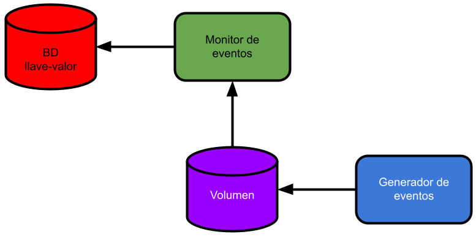

# docker-compose

En este repositorio se encontrarán una serie de archivos que permiten el despliegue de una aplicación como lo indica la figura.



Los archivos relativos al *Generador de eventos* se encuentran en el directorio [generador](generador).
Los archivo del *Monitor de eventos* se encuentran en el directorio [monitor](monitor).

El *Generador de eventos* lo que hace es que cada 15 segundos determina si creará un archivo o no.
El archivo que se generará es de longitud 0 y tendrá un nombre que indica la fecha y hora de creación y con extensión `.txt`.

El archivo *Monitor de eventos* se encarga de revisar periódicamente cuantos archivos con extensión `.txt` se han encontrado. 
El número de archivos encontrados se guarda en una base de datos llave valor. 

---

## Ejecución del aplicativo

Para llevar a cabo la ejecución del aplicativo se debe ejecutar el comando

```
docker-compose up
```
